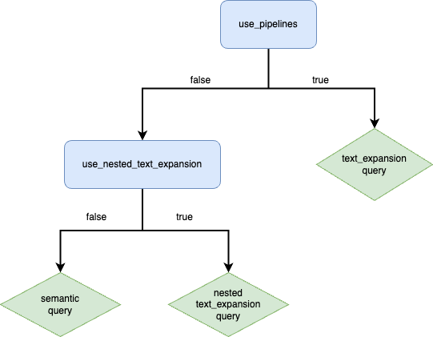

## StackOverflow semantic_text track

This track benchmarks the `semantic_text` field type and `semantic` query performance.
It also enables comparison with existing inference generation & query approaches,
with a focus on comparison with ML inference pipelines and the `text_expansion` query.

The corpus is the same as that used by the `so` track; see `so/README.md` for more info about it.

### Generating the query set

Since the `so` track does not include queries, they were synthetically generated for this track
using the titles of questions from the corpus.
Only the first 1,000,000 questions were used to keep the query file size manageable.

To regenerate the query set from scratch, download the `so` corpus using
[this link](https://rally-tracks.elastic.co/so/posts.json.bz2) and run the query generation script:

```shell
./_tools/generate_queries.py -c 1000000 <path_to_posts_file> queries.txt.bz2
```

### Parameters

This track allows to overwrite the following parameters with Rally 0.8.0+ using `--track-params`:

* `bulk_size` (default: 10)
* `bulk_indexing_clients` (default: 8): Number of clients that issue bulk indexing requests.
* `ingest_percentage` (default: 100): A number between 0 and 100 that defines how much of the document corpus should be ingested.
* `number_of_replicas` (default: 0)
* `number_of_shards` (default: 5)
* `source_enabled` (default: true): A boolean defining whether the `_source` field is stored in the index.
* `index_settings`: A list of index settings. Index settings defined elsewhere (e.g. `number_of_replicas`) need to be overridden explicitly.
* `cluster_health` (default: "green"): The minimum required cluster health.
* `error_level` (default: "non-fatal"): Available for bulk operations only to specify ignore-response-error-level.
* `post_ingest_sleep` (default: false): Whether to pause after ingest and prior to subsequent operations.
* `post_ingest_sleep_duration` (default: 30): Sleep duration in seconds.
* `use_pipelines` (default: false): A boolean defining whether to use an ML inference pipeline or a `semantic_text` field.
                                    This value also controls the query type used in the `semantic-search` operation.
                                    See the flow chart below for more details.
* `elser_model_id` (default: ".elser_model_2"): The name of the ELSER model to use.
* `num_allocations` (default: 1): The number of ELSER allocations to deploy.
* `num_threads` (default: 1): The number of threads to use per ELSER allocation.
* `calculate_body_vector` (default: false): A boolean defining whether inference should be performed on the `body` field during ingest.
* `enable_search` (default: false): A boolean defining if the `semantic-search` operation is enabled.
* `semantic_search_clients` (default: 1): The number of clients that issue queries in the `semantic-search` operation.
* `semantic_search_time_period` (default: 300): The time period, in seconds, to execute the `semantic-search` operation for.
* `semantic_search_warmup_time_period` (default: 10): The warmup time period, in seconds, for the `semantic-search` operation.
* `semantic_search_page_size` (default: 20): The number of results to fetch for each query.
* `use_nested_text_expansion` (default: false): A boolean defining if a nested `text_expansion` query is used instead of a `semantic` query.
                                                See the flow chart below for more details.

When the `semantic-search` operation is enabled, the type of query executed is controlled by multiple parameters:



### License

We use the same license for the data as the original data: [CC-SA-3.0](http://creativecommons.org/licenses/by-sa/3.0/)


